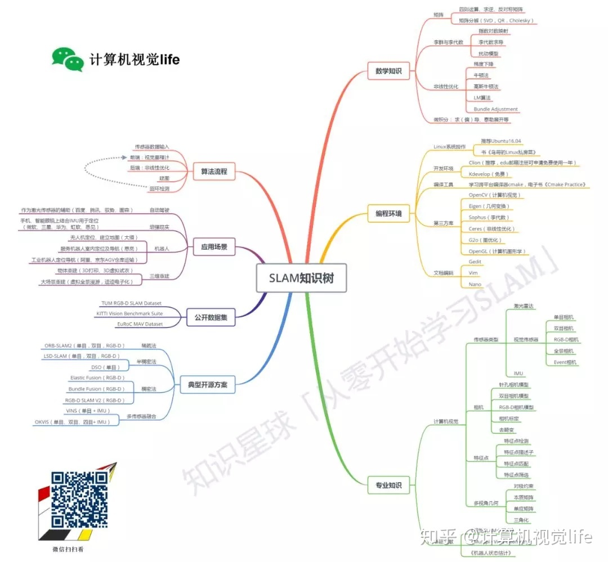

SLAM 是 Simultaneous Localization And Mapping 的英文首字母组合，一般翻译为：同时定位与建图、同时定位与地图构建。SLAM 是三维视觉的核心技术，广泛应用于 AR
、自动驾驶、智能机器人、无人机等前沿热门领域。可以说凡是具有一定行动能力的智能体都拥有某种形式的 SLAM 系统。

# 从零开始学习 SLAM

## [为什么要学 SLAM](https://mp.weixin.qq.com/s?__biz=MzIxOTczOTM4NA==&mid=2247485792&idx=1&sn=358b9bea94cf31b976abc3c12b28f4d7&chksm=97d7ecf7a0a065e1664469c22adce35e6d919d74f5ab95693c8921241f3fefe37fb571527e10&scene=21#wechat_redirect)

计算机视觉可以分为两大方向：基于学习的方法和基于几何的方法。其中基于学习的方法最火的就是深度学习，而基于几何方法最火的就是视觉 SLAM。

没有 SLAM，虚拟现实将永远停留在座椅上。

## [学习 SLAM 到底需要学什么](https://mp.weixin.qq.com/s?__biz=MzIxOTczOTM4NA==&mid=2247485820&idx=1&sn=3fdb40aec678c2ed03e2ecb8ce9bf812&chksm=97d7eceba0a065fdcd70cae70e2910f72850f6ab6303c9b66ec8addaeb1fe633345990544541&scene=21#wechat_redirect)

- 相机相关：单目、双目、RGB-D 等相机的物理参数意义、相机成像模型、相机的标定、去畸变等。双目的话还涉及到视差计算，RGB-D 的话涉及到 RGB 和 depth 图像的对齐等。
- 图像处理相关：特征点描述子、特征点提取、特征点匹配、图像梯度计算、边缘检测、直线检测等。
- 多视角几何相关：对极约束、本质矩阵、单应矩阵、光流估计、三角化等。

## [SLAM 有什么用](https://mp.weixin.qq.com/s?__biz=MzIxOTczOTM4NA==&mid=2247485843&idx=1&sn=e82cbb4a5120d2b5786737f1e0eb66de&chksm=97d7ec04a0a065122d905987de0e369eb769cc711df56b0011094c854e14c03ea13206bca12e&scene=21#wechat_redirect)

定位、建图、路径规划。

SLAM 是指当某种移动设备（如机器人、无人机、手机等）从一个未知环境里的未知地点出发，在运动过程中通过传感器（如激光雷达、摄像头等）观测定位自身位置、姿态、运动轨迹，再根据自身位置进行增量式的地图构建，从而达到同时定位和地图构建的目的。

## [C++11 新特性](https://mp.weixin.qq.com/s?__biz=MzIxOTczOTM4NA==&mid=2247485880&idx=1&sn=e464414da06925c56c35513f4f295b97&chksm=97d7ec2fa0a06539149ff61edc89adb9319d4f3f3ba3634b170e7f83c2e259f2f01ffbf0ac43&scene=21#wechat_redirect)

1. 更方便的列表初始化
    - C++11 前只有数组能使用初始化列表。而 C++11 后大部分类型都可以初始化列表。
2. 省心省力的自动类型推导
    - auto，不影响编译速度
3. 简洁舒服的循环体
    - for(auto n: arr)
4. 简洁的 lambda 表达式
    - \[函数对象参数\]（操作符重载函数参数）->返回值类型{函数体}
5. 随心所欲可变长的参数模板
    - std::make_tuple(), std::tie()

- [C++11 常用特性的使用经验总结](https://www.cnblogs.com/feng-sc/p/5710724.html)
- [C++11 系列-什么是 C++11](http://towriting.com/blog/2013/08/01/what-is-cpp11/)

## [为什么要用齐次坐标](https://mp.weixin.qq.com/s?__biz=MzIxOTczOTM4NA==&mid=2247485921&idx=1&sn=dfccfc8772d4905c744cab53c3c4c7b3&chksm=97d7ec76a0a065608fda155f6de835c534fa2b012b6659d317c279181e040480e6b883867d14&scene=21#wechat_redirect)

1. 能非常方便的表达点在直线或平面上
2. 方便表达直线与直线，平面与平面的交点
3. 能够区分一个向量和一个点
4. 能够表达无穷远
5. 更简洁的表达欧氏空间变换

## [三维空间刚体的旋转](https://mp.weixin.qq.com/s?__biz=MzIxOTczOTM4NA==&mid=2247485988&idx=1&sn=eaec2aa09cb4baeae36d2f669cc89174&chksm=97d7efb3a0a066a50e8ad29f05fe595a304dd19cc55be0edbe83969c3288b97f2fecc77cd440&scene=21#wechat_redirect)

刚体，是指本身不会在运动过程中产生形变的物体，如相机的运动就是刚体运动，**运动过程中同一个向量的长度和夹角都不会发生变化。刚体变换也称为欧式变换**。

1. 旋转矩阵
    1. 旋转矩阵不是一般矩阵，它有比较强的约束条件。旋转矩阵 R 具有正交性，R 和 R 的转置的乘积是单位阵，且行列式值为 1。
    2. 旋转矩阵 R 的逆矩阵表示了一个和 R 相反的旋转。
    3. 旋转矩阵 R 通常和平移向量 t 一起组成齐次的变换矩阵 T，描述了欧氏坐标变换。引入齐次坐标是为了可以方便的描述连续的欧氏变换。
    4. 冗余。用9个元素表示3个自由度的旋转，比较冗余。
2. 四元数
    1. 四元数由一个实部和三个虚部组成，是一种非常紧凑、没有奇异的表达方式。
    2. 注意四元素定义中实部虚部和打印系数的顺序不同，很容易出错！
    3. 单位四元素才能描述旋转，所以四元素使用前必须归一化。
    4. /res/bonus_gimbal_lock.pdf

3. 旋转向量
    1. 用一个旋转轴 n 和旋转角 θ 来描述一个旋转，所以也称轴角。不过很明显，因为旋转角度有一定的周期性（360°一圈），所以这种表达方式具有奇异性。
    2. 从旋转向量到旋转矩阵的转换过程称为罗德里格斯公式。
    3. 旋转向量和旋转矩阵的转换关系，其实对应于李代数和李群的映射。
4. 欧拉角
    1. 把一次旋转分解成 3 次绕不同坐标轴的旋转，比如航空领域经常使用的“偏航-俯仰-滚转”（yaw，pitch，roll）就是一种欧拉角。该表达方式最大的优势就是直观。
    2. 欧拉角在 SLAM 中用的很少，原因是它的一个致命缺点：万向锁。会丢失一个自由度，引起奇异性。事实上，想要表达三维旋转，至少需要4个变量。
    3. /res/quaternion.pdf
5. [Eigen](http://eigen.tuxfamily.org/dox/) 是一个 C++ 开源线性代数库。

---

# References

## [计算机视觉汇总分类](https://mp.weixin.qq.com/s/26iApm5cys3wEEgPC0zUag)

## [从零开始，系统化学习三维视觉核心技术路线](https://mp.weixin.qq.com/s/eWroro-4TJqw3zJdtCLwfA)

## [SLAM 论文阅读和分类整理](https://blog.csdn.net/heyijia0327/article/details/82855443)