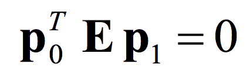
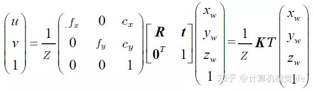

SLAM 是 Simultaneous Localization And Mapping 的英文首字母组合，一般翻译为：同时定位与建图、同时定位与地图构建。SLAM 是三维视觉的核心技术，广泛应用于 AR
、自动驾驶、智能机器人、无人机等前沿热门领域。可以说凡是具有一定行动能力的智能体都拥有某种形式的 SLAM 系统。


Table of Contents
=================

   * [从零开始学习 SLAM](#从零开始学习-slam)
      * [为什么要学 SLAM](#为什么要学-slam)
      * [学习 SLAM 到底需要学什么](#学习-slam-到底需要学什么)
      * [SLAM 有什么用](#slam-有什么用)
      * [C  11 新特性](#c11-新特性)
      * [为什么要用齐次坐标](#为什么要用齐次坐标)
      * [三维空间刚体的旋转](#三维空间刚体的旋转)
      * [李群与李代数](#李群与李代数)
         * [为什么需要李代数](#为什么需要李代数)
         * [李群怎么理解](#李群怎么理解)
         * [李代数和李群有什么关系](#李代数和李群有什么关系)
      * [反对称矩阵](#反对称矩阵)
      * [指数映射](#指数映射)
      * [李群李代数之间的指数对数映射关系](#李群李代数之间的指数对数映射关系)
      * [李代数求导](#李代数求导)
      * [相机成像模型](#相机成像模型)
         * [小孔成像](#小孔成像)
         * [坐标系](#坐标系)
         * [针孔相机成像原理](#针孔相机成像原理)
         * [相机畸变](#相机畸变)
      * [对极约束](#对极约束)
         * [对极几何基本概念](#对极几何基本概念)
         * [理解对极约束](#理解对极约束)
         * [极线方程](#极线方程)
      * [单应矩阵](#单应矩阵)
      * [点云](#点云)
         * [点云的优缺点](#点云的优缺点)
         * [PCL](#pcl)
         * [点云滤波](#点云滤波)
            * [点云下采样](#点云下采样)
            * [去除点云的离群点](#去除点云的离群点)
         * [点云平滑法线估计](#点云平滑法线估计)
            * [点云滤波后还需要平滑](#点云滤波后还需要平滑)
            * [通过重采样实现点云平滑](#通过重采样实现点云平滑)
            * [估计点云的表面法线](#估计点云的表面法线)
         * [点云到网格](#点云到网格)
            * [什么是网格](#什么是网格)
            * [网格生成算法](#网格生成算法)
            * [点云贪心三角化原理](#点云贪心三角化原理)
            * [Delaunay 三角剖分简介](#delaunay-三角剖分简介)
      * [理解图优化](#理解图优化)
         * [图优化的优势](#图优化的优势)
         * [图优化是什么](#图优化是什么)
         * [g2o 框架(General Graphic Optimization)](#g2o-框架general-graphic-optimization)
      * [ICP 原理及应用](#icp-原理及应用)
      * [四元数插值](#四元数插值)
      * [SLAM 技术框架](#slam-技术框架)
         * [SLAM 技术框架](#slam-技术框架-1)
         * [视觉里程计：起源、优势、对比、应用](#视觉里程计起源优势对比应用)
         * [视觉里程计：特征点法之全面梳理](#视觉里程计特征点法之全面梳理)
            * [如何获得好的 VO 效果](#如何获得好的-vo-效果)
            * [特征点法 VO 算法](#特征点法-vo-算法)
   * [References](#references)
      * [计算机视觉汇总分类](#计算机视觉汇总分类)
      * [从零开始，系统化学习三维视觉核心技术路线](#从零开始系统化学习三维视觉核心技术路线)
      * [SLAM 论文阅读和分类整理](#slam-论文阅读和分类整理)

Created by [gh-md-toc](https://github.com/ekalinin/github-markdown-toc) [online](https://sleepeatcode.com/ghtoc)

# 从零开始学习 SLAM

## [为什么要学 SLAM](https://mp.weixin.qq.com/s?__biz=MzIxOTczOTM4NA==&mid=2247485792&idx=1&sn=358b9bea94cf31b976abc3c12b28f4d7&chksm=97d7ecf7a0a065e1664469c22adce35e6d919d74f5ab95693c8921241f3fefe37fb571527e10&scene=21#wechat_redirect)

计算机视觉可以分为两大方向：基于学习的方法和基于几何的方法。其中基于学习的方法最火的就是深度学习，而基于几何方法最火的就是视觉 SLAM。

没有 SLAM，虚拟现实将永远停留在座椅上。

## [学习 SLAM 到底需要学什么](https://mp.weixin.qq.com/s?__biz=MzIxOTczOTM4NA==&mid=2247485820&idx=1&sn=3fdb40aec678c2ed03e2ecb8ce9bf812&chksm=97d7eceba0a065fdcd70cae70e2910f72850f6ab6303c9b66ec8addaeb1fe633345990544541&scene=21#wechat_redirect)


- 相机相关：单目、双目、RGB-D 等相机的物理参数意义、相机成像模型、相机的标定、去畸变等。双目的话还涉及到视差计算，RGB-D 的话涉及到 RGB 和 depth 图像的对齐等。
- 图像处理相关：特征点描述子、特征点提取、特征点匹配、图像梯度计算、边缘检测、直线检测等。
- 多视角几何相关：对极约束、本质矩阵、单应矩阵、光流估计、三角化等。

## [SLAM 有什么用](https://mp.weixin.qq.com/s?__biz=MzIxOTczOTM4NA==&mid=2247485843&idx=1&sn=e82cbb4a5120d2b5786737f1e0eb66de&chksm=97d7ec04a0a065122d905987de0e369eb769cc711df56b0011094c854e14c03ea13206bca12e&scene=21#wechat_redirect)

定位、建图、路径规划。

SLAM 是指当某种移动设备（如机器人、无人机、手机等）从一个未知环境里的未知地点出发，在运动过程中通过传感器（如激光雷达、摄像头等）观测定位自身位置、姿态、运动轨迹，再根据自身位置进行增量式的地图构建，从而达到同时定位和地图构建的目的。

## [C++11 新特性](https://mp.weixin.qq.com/s?__biz=MzIxOTczOTM4NA==&mid=2247485880&idx=1&sn=e464414da06925c56c35513f4f295b97&chksm=97d7ec2fa0a06539149ff61edc89adb9319d4f3f3ba3634b170e7f83c2e259f2f01ffbf0ac43&scene=21#wechat_redirect)

1. 更方便的列表初始化
    - C++11 前只有数组能使用初始化列表。而 C++11 后大部分类型都可以初始化列表。
2. 省心省力的自动类型推导
    - auto，不影响编译速度
3. 简洁舒服的循环体
    - for(auto n: arr)
4. 简洁的 lambda 表达式
    - \[函数对象参数\]（操作符重载函数参数）->返回值类型{函数体}
5. 随心所欲可变长的参数模板
    - std::make_tuple(), std::tie()

- [C++11 常用特性的使用经验总结](https://www.cnblogs.com/feng-sc/p/5710724.html)
- [C++11 系列-什么是 C++11](http://towriting.com/blog/2013/08/01/what-is-cpp11/)

## [为什么要用齐次坐标](https://mp.weixin.qq.com/s?__biz=MzIxOTczOTM4NA==&mid=2247485921&idx=1&sn=dfccfc8772d4905c744cab53c3c4c7b3&chksm=97d7ec76a0a065608fda155f6de835c534fa2b012b6659d317c279181e040480e6b883867d14&scene=21#wechat_redirect)

1. 能非常方便的表达点在直线或平面上
2. 方便表达直线与直线，平面与平面的交点
3. 能够区分一个向量和一个点
4. 能够表达无穷远
5. 更简洁的表达欧氏空间变换

## [三维空间刚体的旋转](https://mp.weixin.qq.com/s?__biz=MzIxOTczOTM4NA==&mid=2247485988&idx=1&sn=eaec2aa09cb4baeae36d2f669cc89174&chksm=97d7efb3a0a066a50e8ad29f05fe595a304dd19cc55be0edbe83969c3288b97f2fecc77cd440&scene=21#wechat_redirect)

刚体，是指本身不会在运动过程中产生形变的物体，如相机的运动就是刚体运动，**运动过程中同一个向量的长度和夹角都不会发生变化。刚体变换也称为欧式变换**。

1. 旋转矩阵
    1. 旋转矩阵不是一般矩阵，它有比较强的约束条件。旋转矩阵 R 具有正交性，R 和 R 的转置的乘积是单位阵，且行列式值为 1。
    2. 旋转矩阵 R 的逆矩阵表示了一个和 R 相反的旋转。
    3. 旋转矩阵 R 通常和平移向量 t 一起组成齐次的变换矩阵 T，描述了欧氏坐标变换。引入齐次坐标是为了可以方便的描述连续的欧氏变换。
    4. 冗余。用9个元素表示3个自由度的旋转，比较冗余。
2. 四元数
    1. 四元数由一个实部和三个虚部组成，是一种非常紧凑、没有奇异的表达方式。
    2. 注意四元素定义中实部虚部和打印系数的顺序不同，很容易出错！
    3. 单位四元素才能描述旋转，所以四元素使用前必须归一化。
    4. /res/bonus_gimbal_lock.pdf

3. 旋转向量
    1. 用一个旋转轴 n 和旋转角 θ 来描述一个旋转，所以也称轴角。不过很明显，因为旋转角度有一定的周期性（360°一圈），所以这种表达方式具有奇异性。
    2. 从旋转向量到旋转矩阵的转换过程称为罗德里格斯公式。
    3. 旋转向量和旋转矩阵的转换关系，其实对应于李代数和李群的映射。
4. 欧拉角
    1. 把一次旋转分解成 3 次绕不同坐标轴的旋转，比如航空领域经常使用的“偏航-俯仰-滚转”（yaw，pitch，roll）就是一种欧拉角。该表达方式最大的优势就是直观。
    2. 欧拉角在 SLAM 中用的很少，原因是它的一个致命缺点：万向锁。会丢失一个自由度，引起奇异性。事实上，想要表达三维旋转，至少需要4个变量。
    3. /res/quaternion.pdf
5. [Eigen](http://eigen.tuxfamily.org/dox/) 是一个 C++ 开源线性代数库。


## [李群与李代数](https://mp.weixin.qq.com/s?__biz=MzIxOTczOTM4NA==&mid=2247486047&idx=1&sn=25d97bb47c26ac3babafd668ee0c013b&chksm=97d7efc8a0a066de0990dc79de32c666aff4698aa1f8dbfc131cc426e6beba96cd5260d0a667&scene=21#wechat_redirect)

### 为什么需要李代数

旋转矩阵对加法不封闭。李代数就是解决这个问题的。把大写 SE(3) 空间的 T 映射为一种叫做李代数的东西，映射后的李代数叫做小 se(3)。它是由向量组成的，我们知道向量是对加法封闭的。这样我们就可以通过对李代数求导来间接的对变换矩阵求导了。

### 李群怎么理解

群（group）就是一种集合加上一种运算的代数结构。群有几个运算性质：封闭性，结合律，幺元，逆元（凤姐咬你）。

旋转矩阵和乘法构成了旋转矩阵群（SO(3)，特殊正交群)，变换矩阵和乘法构成了变换矩阵群（SE(3)，特殊欧式群)。

李群的定义是指连续光滑的群，

### 李代数和李群有什么关系

李代数对应李群的正切空间，它描述了李群局部的导数。

旋转矩阵的微分是一个反对称矩阵左乘它本身。对于某个时刻的 R(t)（李群空间），存在一个三维向量 φ=（φ1，φ2，φ3）（李代数空间），用来描述 R 在 t 时刻的局部的导数。

'.jpg)

## 反对称矩阵


三维反对称矩阵只有3个自由度，这样就可以把一个三维向量和一个三维矩阵建立对应关系。

## 指数映射


这个 φ 正是李群大 SO(3) 对应的李代数小 so(3)。


小 so(3) 的李代数空间就是由旋转向量组成的的空间，其物体意义就是旋转向量。而上面的指数映射关系就是罗德里格斯公式，他们在数学上本质是一样的。

旋转矩阵的导数可以由其对应的旋转向量指定，指导如何在旋转矩阵中进行微积分运算。

## 李群李代数之间的指数对数映射关系


## 李代数求导

李代数求导分两种：一种是用李代数表示位姿，然后根据李代数加法来对李代数求导。结果中有复杂的雅克比公式，不是很方便。一般都用第二种，对李群进行左乘或者右乘微小的扰动，然后对该扰动求导。


- [SO(3) 左扰动模型，SO(3) 李代数求导，SE(3) 左扰动模型讲解视频](https://v.qq.com/x/page/p0758q8ohvo.html)

## [相机成像模型](https://mp.weixin.qq.com/s?__biz=MzIxOTczOTM4NA==&mid=2247486116&idx=1&sn=38252b8f03ef16122e3ac494d7ec8740&chksm=97d7ef33a0a06625b34d491fc83c5e6e820baa11c6f9f0c113e32fdb7c7bf1e04e40fd8019ab&scene=21#wechat_redirect)

### 小孔成像

把倒立的实像去掉，用正立的虚像代替。三维空间的点大 P 在成像平面上成的像就是小 p。大 P，小 p 还有相机中心 C 在同一条直线上。


### 坐标系

- 世界坐标系(world coordinate system)：是用户定义的三维世界的坐标系，以某个点为原点，为了描述目标物在真实世界里的位置而被引入。单位为m。
- 相机坐标系(camera coordinate system)：是以相机为原点建立的坐标系，为了从相机的角度描述物体位置而定义，作为沟通世界坐标系和图像/像素坐标系的中间一环。单位为m。


- 图像坐标系(image coordinate system)：是为了描述成像过程中物体从相机坐标系到图像坐标系的投影透射关系而引入，是我们真正从相机内读取到的图像所在的坐标系。单位为像素。

### 针孔相机成像原理


其中 fx, fy 分别是 x, y 方向焦距，一般都是相等的，cx, cy 是光心位置，一般是长和宽的一半，都是内参，此外还有畸变系数也属于内参，他们都是相机固有参数。

### 相机畸变

畸变产生的原因是：透镜不能完全满足针孔模型假设。

相机透镜的畸变主要分为径向畸变和切向畸变，还有其他的畸变，但都没有径向和切向畸变影响显著，所以在这里只考虑径向和切向畸变。

径向畸变是由于相机透镜的形状导致的，且越向透镜边缘移动径向畸变越严重。分为桶形和枕形。

切向畸变是由于透镜和 CMOS 或者 CCD 的安装位置误差导致。如果存在切向畸变，一个矩形被投影到成像平面上时，很可能会变成一个梯形。不过随着相机制造工艺的大大提升，这种情况很少出现了，所以一般也不考虑切向的畸变。

## [对极约束](https://mp.weixin.qq.com/s?__biz=MzIxOTczOTM4NA==&mid=2247486151&idx=1&sn=2b322f466d916704b1070ece20e669db&chksm=97d7ef50a0a06646a984fcbf82870011ec10a9233899ee74fe8c09432517c5efaa285f1897c9&scene=21#wechat_redirect)

### 对极几何基本概念


C0-C1-P 组成的平面称为极平面（epipolar plane），和成像平面相交的直线称之为极线（epipolar line），两个光心 C0, C1 和成像平面的交点叫做极点（epipole）。

### 理解对极约束


### 极线方程




## [单应矩阵](https://mp.weixin.qq.com/s?__biz=MzIxOTczOTM4NA==&mid=2247486191&idx=1&sn=3b33d748dd4cd035e429665ef1e40299&chksm=97d7ef78a0a0666ebdd86886241b19c0a77a0ec8fa5e1a1ff5de2ae3e89740ffc5516f942bab&scene=21#wechat_redirect)





## [点云](https://mp.weixin.qq.com/s?__biz=MzIxOTczOTM4NA==&mid=2247486281&idx=1&sn=1b36bcfd9f492dabc44ae2f10562e040&chksm=97d7eedea0a067c89eb9b1e71f7cf5dd12410c8c81d43dc2a21f9c6f28babd7add017ad14705&scene=21#wechat_redirect)

### 点云的优缺点

第一个优点就是可以表达物体的空间轮廓和具体位置。第二个优点就是，点云本身和视角无关，也就是你可以任意旋转，可以从不同角度和方向观察一个点云，而且不同的点云只要在同一个坐标系下就可以直接融合。

第一个缺点就是点云并不是稠密的表达，一般比较稀疏，在空间很多位置其实没有点云，这部分的信息是缺失的。第二个缺点就是点云的分辨率和离相机的距离有关。离近了看是看不清是什么的，只能拉的很远才能看个大概。

### [PCL](http://docs.pointclouds.org/trunk/index.html)


### [点云滤波](https://mp.weixin.qq.com/s?__biz=MzIxOTczOTM4NA==&mid=2247486610&idx=1&sn=145132b3de5600d3a288c00bd50a7fa7&chksm=97d7e905a0a0601389157ca27a1be2618243f822583c5660ea18ff51f88f317fe8ac84360856&scene=21#wechat_redirect)

滤波原因：

1. 点云数据密度不规则需要平滑
2. 因为遮挡等问题造成离群点需要去除
3. 大量数据需要下采样
4. 噪声数据需要去除

滤波方案：

1. 按照给定的规则限制过滤去除点
2. 通过常用滤波算法修改点的部分属性
3. 对数据进行下采样

#### 点云下采样

```c
pcl::ApproximateVoxelGrid< PointT >
```

对输入的点云数据创建一个三维体素栅格，每个体素内用体素中所有点的重心来近似显示体素中其他点，这样该体素内所有点都用一个重心点最终表示。它的优点是可以在下采样的时候保存点云的形状特征。

#### 去除点云的离群点

离群点会使局部点云特征(如表面法线或曲率变化)的估计复杂化，从而导致错误的值，从而可能导致点云配准失败。而且这些离群点还会随着积累进行传导。

```c
pcl::StatisticalOutlierRemoval< pcl::PointXYZ >
```

对每个点的邻域进行统计分析，剔除不符合一定标准的邻域点。具体来说，对于每个点，我们计算它到所有相邻点的平均距离。假设得到的分布是高斯分布，可以计算出一个均值 μ 和一个标准差 σ，那么这个邻域点集中所有点与其邻域距离大于 μ + std_mul * σ 区间之外的点都可以被视为离群点，并可从点云数据中去除。std_mul 是标准差倍数的一个阈值。

```c
pcl::RadiusOutlierRemoval< pcl::PointXYZ > 
```

根据空间点半径范围临近点数量来滤波。在点云数据中，设定每个点一定半径范围内周围至少有足够多的近邻，不满足就会被删除。

### [点云平滑法线估计](https://mp.weixin.qq.com/s?__biz=MzIxOTczOTM4NA==&mid=2247486705&idx=1&sn=ca333d7bb12b7c226270e98d0003a789&chksm=97d7e966a0a06070a8dba605966016d227d7a6cad786498070d9e1b8cea8747470a4840257fd&scene=21#wechat_redirect)

#### 点云滤波后还需要平滑

用 RGB-D，激光扫描仪等设备扫描物体，尤其是比较小的物体时，往往会有测量误差。这些误差所造成的不规则数据如果直接拿来曲面重建的话，会使得重建的曲面不光滑或者有漏洞，而且这种不规则数据很难用前面提到过的统计分析等滤波方法消除，所以为了建立光滑完整的模型必须对物体表面进行平滑处理和漏洞修复。

#### 通过重采样实现点云平滑

点云重采样，实际上是通过“移动最小二乘”（MLS， Moving Least Squares ）法来实现的。

```c
pcl::MovingLeastSquares< PointT, PointT >
```

#### 估计点云的表面法线

法线的用处：尤其是在三维建模中应用非常广泛，比如在计算机图形学（computer graphics）领域里，法线决定着曲面与光源（light source）的强弱处理（Flat Shading），对于每个点光源位置，其亮度取决于曲面法线的方向。

点云的法线计算一般有两种方法：

1. 使用曲面重建方法，从点云数据中得到采样点对应的曲面，然后再用曲面模型计算其表面的法线；
2. 直接使用近似值直接从点云数据集推断出曲面法线。

```c
// 直接使用近似值直接从点云数据集推断出曲面法线
pcl::NormalEstimation< PointT, pcl::Normal > 
```

### [点云到网格](https://mp.weixin.qq.com/s?__biz=MzIxOTczOTM4NA==&mid=2247486802&idx=1&sn=e765587e990fb0108a5ae673c7a6e641&chksm=97d7e8c5a0a061d3686f2c0e171a312b7fedda7e7af09277301920e246d21a05dae83a60c2b0&scene=21#wechat_redirect)

#### 什么是网格

网格主要用于计算机图形学中，有三角、四角网格等很多种。不过，计算机图形学中的网格处理绝大部分都是基于三角网格的。

三角形表示网格也叫三角剖分。它有如下几个优点：

1. 稳定性强。
2. 三角网格比较简单（主要原因），实际上三角网格是最简单的网格类型之一，可以非常方便并且快速生成，在非结构化网格中最常见。而且相对于一般多边形网格，许多操作对三角网格更容易。
3. 有助于恢复模型的表面细节。

三角网格需要存储三类信息：

1. 顶点。每个三角形都有三个顶点，各顶点都有可能和其他三角形共享。
2. 边。连接两个顶点的边，每个三角形有三条边。
3. 面。每个三角形对应一个面，我们可以用顶点或边列表表示面。

#### 网格生成算法

点云面临的问题：

1. 点云噪声。 每个点云都会带有噪声，噪声有可能和物体表面光学性质、物体深度、传感器性能等都有关系。
2. 点云匹配误差。三维重建中需要将不同帧得到的点云估计其在世界坐标系下的位姿，会引入一定的位置误差。
3. 点云分布。分布的不均匀性体现在两个方面。一个是每个点云在不同的方向上分布是不均匀的另一个是不同的点云匹配后，不同位置的点云密度是不一样的。
4. 缺失数据。 扫描中如果碰到不易成像的部位（比如不可见、反光等等），那么这部分的数据是缺失的，点云是不完整的。

网格生成算法的要求：

1. 对点云噪声有一定的冗余度。
2. 能够重建出曲率变化比较大的曲面。
3. 能够处理大数据量，算法时间和空间复杂度不会太高。
4. 重建出的网格中包含尽可能少的异常三角片，比如三角片交错在一起、表面法向量不连续或不一致、同一个位置附近出现多层三角片等。

常用网格生成算法：

1. 插值法。重建的曲面都是通过原始的数据点得到的。
2. 逼近法。用分片线性曲面或其他曲面来逼近原始数据点，得到的重建曲面是原始点集的一个逼近。

#### 点云贪心三角化原理

```c
pcl::GreedyProjectionTriangulation< pcl::PointNormal >
```

该算法的优点是可以用来处理来自一个或者多个设备扫描到得到、并且有多个连接处的散乱点云。但是也是有很大的局限性，它更适用于采样点云来自表面连续光滑的曲面，并且点云的密度变化比较均匀的情况。所以之前需要进行点云滤波和平滑。

贪心投影三角化的流程的：

1. 先将点云通过法线投影到某一二维坐标平面内。
2. 然后对投影得到的点云做平面内的三角化，从而得到各点的拓扑连接关系。平面三角化的过程中用到了基于 Delaunay 三角剖分的空间区域增长算法。
3. 最后根据平面内投影点的拓扑连接关系确定各原始三维点间的拓扑连接，所得三角网格即为重建得到的曲面模型。

#### Delaunay 三角剖分简介

Delaunay 三角剖分的有两个优点：

1. 最大化最小角，“最接近于规则化的“的三角网。
2. 唯一性（任意四点不能共圆）。

Delaunay 条件：所有三角形的顶点都不在其他三角形的外接圆内。

Delaunay 三角剖分：它通过选取一个样本三角片作为初始曲面，不断扩张延伸曲面的边界，直到所有符合几何正确性和拓扑正确性的点都被连上，最后形成一张完整的三角网格曲面。

## [理解图优化](https://mp.weixin.qq.com/s?__biz=MzIxOTczOTM4NA==&mid=2247486858&idx=1&sn=ce458d5eb6b1ad11b065d71899e31a04&chksm=97d7e81da0a0610b1e3e12415b6de1501329920c3074ab5b48e759edbb33d264a73f1a9f9faf&scene=21#wechat_redirect)

### 图优化的优势

SLAM 的后端一般分为两种处理方法，一种是以扩展卡尔曼滤波（EKF）为代表的滤波方法，一种是以图优化为代表的非线性优化方法。目前 SLAM 研究的主流热点几乎都是基于图优化的。

代表性的就是2009年，《SBA：A software package for generic sparse bundle adjustment》，基于图优化的视觉 SLAM 可以实时了。

### 图优化是什么

图优化里的图就是数据结构里的图，一个图由若干个顶点（vertex），以及连接这些顶点的边（edge）组成。

在 SLAM 里，图优化一般分解为两个任务：

1. 构建图。相机位姿作为顶点，位姿间关系作为边。
2. 优化图。调整相机的位姿（顶点）来尽量满足边的约束，使得误差最小。

### [g2o 框架(General Graphic Optimization)](https://github.com/RainerKuemmerle/g2o)


- [g2o 顶点](https://mp.weixin.qq.com/s?__biz=MzIxOTczOTM4NA==&mid=2247486992&idx=1&sn=ecb7c3ef9bd968e51914c2f5b767428d&chksm=97d7eb87a0a062912a9db9fb16a08129f373791fd3918952342d5db46c0bc4880326a7933671&scene=21#wechat_redirect)
- [g2o 边](https://mp.weixin.qq.com/s?__biz=MzIxOTczOTM4NA==&mid=2247487082&idx=1&sn=d4a27e4c9a76760fffb571f57f4f7719&chksm=97d7ebfda0a062eba412877e9ecf5933f2051f0210c0d56f03267985512d97f2db434ab7356c&scene=21#wechat_redirect)

## [ICP 原理及应用](https://mp.weixin.qq.com/s?__biz=MzIxOTczOTM4NA==&mid=2247487562&idx=1&sn=f1c5030d8bb7e58891d49ee7d245ab7e&chksm=97d7f5dda0a07ccba22349823cf63fdfee955794fa19cd89bcef159210a5192ad8d96ea412a2&scene=21#wechat_redirect)

ICP 全称 Iterative Closest Point，就是迭代最近点。ICP在点云配准领域应用的非常广泛，因此基于深度相机、激光雷达的算法使用ICP的频率比较高。

ICP 算法流程：

1. 首先对于一幅点云中的每个点，在另一幅点云中计算匹配点（最近点）。
2. 极小化匹配点间的匹配误差，计算位姿。
3. 然后将计算的位姿作用于点云。
4. 再重新计算匹配点。
5. 如此迭代，直到迭代次数达到阈值，或者极小化的能量函数变化量小于设定阈值。

## [四元数插值](https://mp.weixin.qq.com/s?__biz=MzIxOTczOTM4NA==&mid=2247488219&idx=1&sn=bbcdb7e680763aa21b5c31dd055842b6&chksm=97d7f74ca0a07e5a1cb96a2b81edf27ac777c33bb368aa7ca2da17bf0da3167056bbd92f4fbf&scene=21#wechat_redirect)

- 线性插值
- 球面线性插值

## [SLAM 技术框架](https://mp.weixin.qq.com/s?__biz=MzIxOTczOTM4NA==&mid=2247484338&idx=1&sn=ba5db3dbe46728706b006a9554a6862a&chksm=97d7e625a0a06f3380c5c75c8501a2ba589d6288086268f0424e3d2091c72daaf0abbb0004f5&scene=21#wechat_redirect)

### SLAM 技术框架


- 预处理
    - 传感器数据预处理。
- 前端
    - 又称为视觉里程计（visual odometry，简称VO）。
    - 主要是研究如何根据相邻帧图像定量估算帧间相机的运动。
    - 只计算相邻帧的运动，进行局部估计，这会不可避免的出现累积漂移，这是因为每次估计两个图像间的运动时都有一定的误差，经过相邻帧多次传递，前面的误差会逐渐累积，轨迹漂移（drift）的越来越厉害。
    - 解决轨迹漂移的方法有两个：后端优化、回环检测。
- 后端
    - 对前端的结果进行优化，得到最优的位姿估计。
    - 主要有两种方法：基于滤波理论的优化（EKF（扩展[卡尔曼滤波](https://zhuanlan.zhihu.com/p/39912633)））；非线性优化（图优化）。
- 回环检测
    - 主要目的是让相机能够认识自己曾经去过的地方，从而解决位置随时间漂移的问题。
    - 当回环检测成功后，就会建立现在的图像和过去曾经见过图像的对应关系，后端优化算法可以根据这些信息来重新调整轨迹和地图，从而最大限度地消除累积误差。
- 建立地图

### [视觉里程计：起源、优势、对比、应用](https://mp.weixin.qq.com/s?__biz=MzIxOTczOTM4NA==&mid=2247484393&idx=1&sn=8b2ddf91d57cd53fe15a804d457f96cc&chksm=97d7e67ea0a06f68ede23bf24606333b56a0b2f07a674eb0b8d5009ccae64524d9fcbc79e9f0&scene=21#wechat_redirect)

**VO vs. Structure from Motion（SfM）**：

> 视觉里程计概念来自车轮里程计。视觉里程计是通过移动物体（如车辆、人、机器人）上搭载的单个或多个相机拍摄的连续图像作为输入，从而增量式地估计物体自身的运动状态。
>
> SfM
> 中文译为运动恢复结构。是指从一组相机图像（有序或者无序都可以）中恢复相机位置姿态和重建三维结构的一种通用方法。最终结构和相机位姿通过离线优化算法来进一步提升效果，它的计算时间随图像的数量增加而增长。SfM
> 的一个比较著名的项目就是[《Building Rome in a Day》](http://grail.cs.washington.edu/projects/rome/index.html
>)：该项目利用网上搜集到的以罗马为关键词的200万张图片，经过一天的计算时间实现了对罗马的三维重建。

### [视觉里程计：特征点法之全面梳理](https://mp.weixin.qq.com/s?__biz=MzIxOTczOTM4NA==&mid=2247484413&idx=1&sn=5d62ae75e7303647dffd7342027778ba&chksm=97d7e66aa0a06f7cd71b63ca5668b6f3c093a9c83c21d47160cc3971ca2846d661c20b1746db&scene=21#wechat_redirect)

根据 VO 是否需要提取特征点，VO 的具体实现方法可以分为基于特征点法的 VO 和直接法 VO。特征点法 VO 是以提取图像中的特征点为基础，学术界有长久的研究，运行比较稳定、对光照变化和动态场景鲁棒性强，是比较成熟的 VO
 实现方案。而直接法 VO 是为了克服特征点法 VO 的部分缺点（如计算量大，不适用于纹理缺乏场景等）而出现的。

#### 如何获得好的 VO 效果

1. 环境的光照强度比较合适，不能太暗或者太亮。
2. 环境具有相对丰富的纹理。
3. 需要捕捉连续的图像，保证相邻图像帧的内容有足够的重叠区域。
4. 最好是静态场景下运行。

#### 特征点法 VO 算法

1. 特征点检测
    - 特征点的选择和设计非常重要。优秀的特征点应该具有以下特征：
        1. 高辨识度。能够和周围的像素进行明显的区分，具有极强的代表性。
        2. 可重复性强。相同的特征点可以在下一幅图像中被再次检测到，这样才能进行特征点匹配。
        3. 高鲁棒性。在光照变化、几何变化（旋转、缩放，透视变形）时能够保持没有明显变化，在图像中存在噪声，压缩损伤，模糊等情况下仍然能够检测到。
        4. 计算效率高。
    - 常用特征点：SIFT，FAST，ORB 
2. 特征匹配
    - 暴力匹配，握手匹配，快速近似最近邻匹配（FLANN）
3. 运动估计
    1. 2D-2D：对极约束(极线约束)
    2. 3D-3D：迭代最近点（iterative closest point, ICP）
    3. 3D-2D：PnP(perspective-n-point)
4. 离群点移除
    - 最常用的离群点去除方法就是随机采样一致算法（Random Sample Consensus，RANSAC）
5. Bundle Adjustment 优化
    - BA 的本质是一个优化模型，其目的是最小化重投影误差。

---

# References

## [计算机视觉汇总分类](https://mp.weixin.qq.com/s/26iApm5cys3wEEgPC0zUag)

## [从零开始，系统化学习三维视觉核心技术路线](https://mp.weixin.qq.com/s/eWroro-4TJqw3zJdtCLwfA)

## [SLAM 论文阅读和分类整理](https://blog.csdn.net/heyijia0327/article/details/82855443)